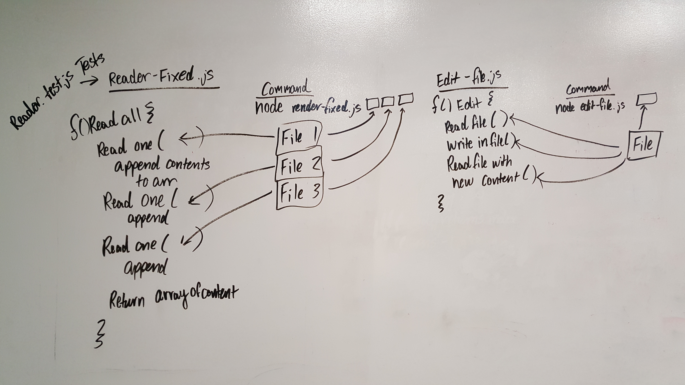

 LAB
=================================================

## FS

### Author: Spencer Hirata

### Links and Resources
* [repo](https://github.com/401-advanced-js/lab-03)

#### Documentation
* [jsdoc]()

### Modules
#### `modulename.js`
##### Exported Values and Methods

###### `foo(thing) -> string`
Usage Notes or examples

### Setup

#### Running the app
* `npm install fs faker`

#### Assignment 1: edit-file.js

* `node edit-file.js ./files/test.txt`

#### Assignment 2: reader.js

* `node index.js ./files/1.txt ./files/2.txt ./files/3.txt`

#### Tests
* `npm test`~ THIS IS ONLY FOR THE reader-fixed.js FILE

* Tests if the file is 'bad.txt' which is completely useless

* Tests if any of the file paths don't exist and returns null

#### UML

